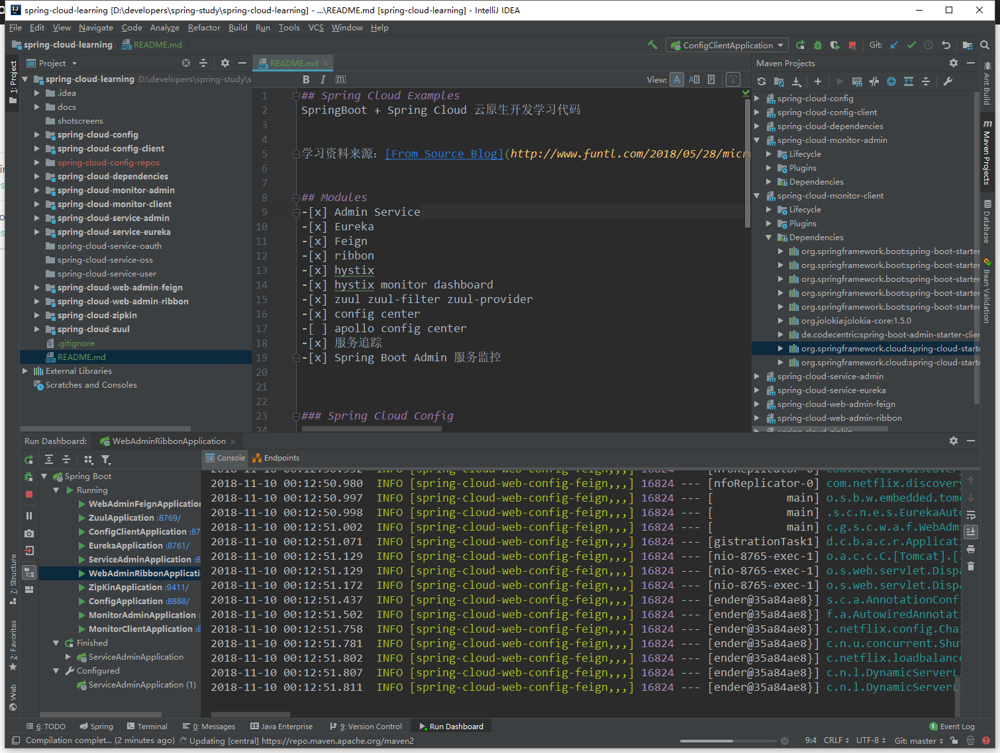
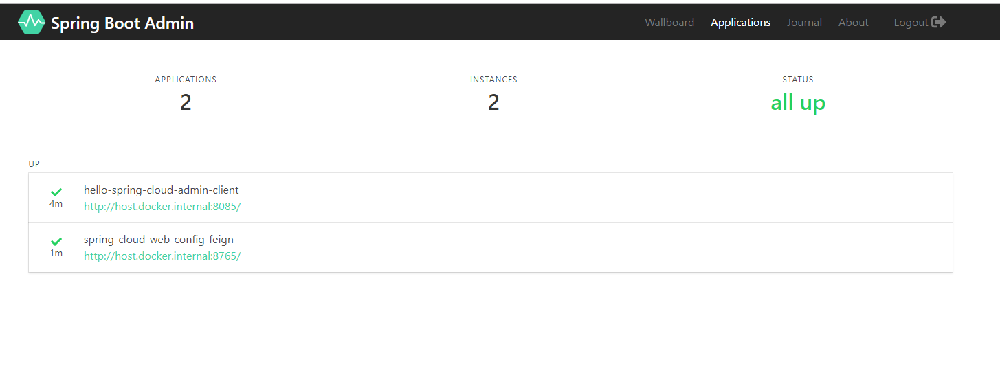
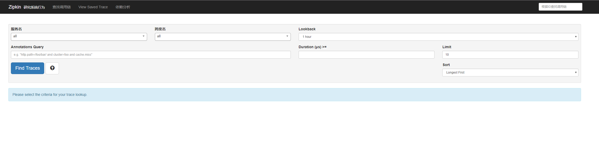
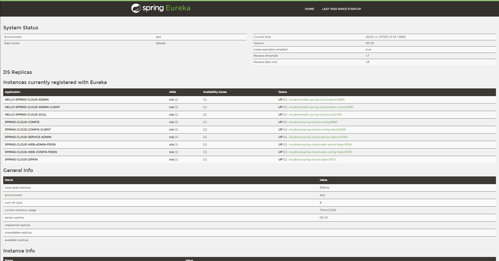

## Spring Cloud Examples
SpringBoot + Spring Cloud 云原生开发学习代码


学习资料来源：[From Source Blog](http://www.funtl.com/2018/05/28/microservice/%E5%86%8D%E8%B0%88%E5%BE%AE%E6%9C%8D%E5%8A%A1-%E5%BE%AE%E6%9C%8D%E5%8A%A1%E6%9E%B6%E6%9E%84%E8%AE%BE%E8%AE%A1%E6%A8%A1%E5%BC%8F/)


## Modules
-[x] Admin Service
-[x] Eureka 注册中心
-[x] Feign feign消费者
-[x] ribbon ribbon 消费者
-[x] hystix 熔断器
-[x] hystix monitor dashboard 服务熔断监控
-[x] zuul zuul-filter zuul-provider  网关
-[x] config center 配置中心
-[ ] apollo config center 
-[x] 服务追踪
-[x] Spring Boot Admin 服务监控


### Spring Cloud Config

```
http://localhost:8888/web-admin-feign/master 
http://localhost:8888/web-admin-feign-prod.yml
```

## screenshots







